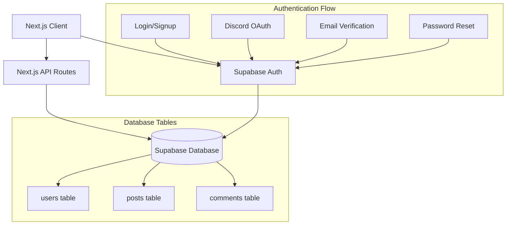

# Design Document

## Overview

이 문서는 Supabase를 기반으로 한 인증 시스템의 기술적 설계를 정의합니다. 기존 포트폴리오 웹사이트에 사용자 인증, 회원 관리, 댓글 시스템을 통합하여 완전한 사용자 경험을 제공합니다.

## Architecture

### High-Level Architecture



### Technology Stack

- **Frontend**: Next.js 15, React 19, TypeScript
- **Authentication**: Supabase Auth
- **Database**: Supabase PostgreSQL
- **UI Components**: Radix UI, Tailwind CSS
- **Form Handling**: React Hook Form, Zod
- **State Management**: React Context + Hooks

## Components and Interfaces

### Authentication Components

#### 1. AuthProvider Context
```typescript
interface AuthContextType {
  user: User | null
  session: Session | null
  loading: boolean
  signUp: (email: string, password: string, metadata: UserMetadata) => Promise<AuthResponse>
  signIn: (email: string, password: string) => Promise<AuthResponse>
  signInWithOAuth: (provider: 'discord') => Promise<AuthResponse>
  signOut: () => Promise<void>
  resetPassword: (email: string) => Promise<AuthResponse>
  updateProfile: (updates: ProfileUpdates) => Promise<void>
}
```

#### 2. Authentication Pages
- `/auth/login` - 로그인 페이지
- `/auth/signup` - 회원가입 페이지
- `/auth/reset-password` - 비밀번호 재설정 페이지
- `/auth/callback` - OAuth 콜백 처리
- `/auth/confirm` - 이메일 확인 처리

#### 3. Protected Route Component
```typescript
interface ProtectedRouteProps {
  children: React.ReactNode
  fallback?: React.ReactNode
  requireAuth?: boolean
}
```

#### 4. User Profile Components
- `UserMenu` - 네비게이션 사용자 메뉴
- `ProfilePage` - 프로필 조회/수정 페이지
- `ProfileForm` - 프로필 수정 폼

### Comment System Components

#### 1. Comment Components
```typescript
interface CommentProps {
  comment: CommentWithAuthor
  onEdit?: (id: string, content: string) => Promise<void>
  onDelete?: (id: string) => Promise<void>
  currentUserId?: string
}

interface CommentFormProps {
  postId: string
  onSubmit: (content: string) => Promise<void>
  placeholder?: string
}
```

#### 2. Comment Hooks
```typescript
const useComments = (postId: string) => {
  comments: CommentWithAuthor[]
  loading: boolean
  addComment: (content: string) => Promise<void>
  updateComment: (id: string, content: string) => Promise<void>
  deleteComment: (id: string) => Promise<void>
}
```

## Data Models

### Database Schema Updates

#### 1. Enhanced Users Table
```sql
-- Update existing users table
ALTER TABLE public.users 
  ADD COLUMN IF NOT EXISTS email text,
  ADD COLUMN IF NOT EXISTS email_verified boolean DEFAULT false,
  ADD COLUMN IF NOT EXISTS created_at timestamptz DEFAULT now(),
  ADD COLUMN IF NOT EXISTS updated_at timestamptz DEFAULT now();

-- Add unique constraint on email
ALTER TABLE public.users ADD CONSTRAINT users_email_unique UNIQUE (email);

-- Update index
CREATE INDEX IF NOT EXISTS idx_users_email ON public.users(email);
```

#### 2. Comments Table Enhancement
```sql
-- Add foreign key constraint to comments table
ALTER TABLE public.comments 
  ADD CONSTRAINT comments_author_id_fkey 
  FOREIGN KEY (author_id) REFERENCES public.users(id) ON DELETE SET NULL;

-- Add updated_at column for comment editing
ALTER TABLE public.comments 
  ADD COLUMN IF NOT EXISTS updated_at timestamptz DEFAULT now();
```

#### 3. Row Level Security (RLS) Policies
```sql
-- Enable RLS on tables
ALTER TABLE public.users ENABLE ROW LEVEL SECURITY;
ALTER TABLE public.comments ENABLE ROW LEVEL SECURITY;
ALTER TABLE public.posts ENABLE ROW LEVEL SECURITY;

-- Users can read all user profiles but only update their own
CREATE POLICY "Users can view all profiles" ON public.users
  FOR SELECT USING (true);

CREATE POLICY "Users can update own profile" ON public.users
  FOR UPDATE USING (auth.uid() = id);

-- Comments policies
CREATE POLICY "Anyone can view comments" ON public.comments
  FOR SELECT USING (true);

CREATE POLICY "Authenticated users can create comments" ON public.comments
  FOR INSERT WITH CHECK (auth.uid() = author_id);

CREATE POLICY "Users can update own comments" ON public.comments
  FOR UPDATE USING (auth.uid() = author_id);

CREATE POLICY "Users can delete own comments" ON public.comments
  FOR DELETE USING (auth.uid() = author_id);
```

### TypeScript Interfaces

#### 1. User Types
```typescript
interface User {
  id: string
  email: string
  username: string
  display_name: string
  avatar: string | null
  provider: string
  email_verified: boolean
  created_at: string
  updated_at: string
}

interface UserMetadata {
  username: string
  display_name: string
}

interface ProfileUpdates {
  username?: string
  display_name?: string
  avatar?: string
}
```

#### 2. Comment Types
```typescript
interface Comment {
  id: string
  post_id: string
  author_id: string
  content: string
  created_at: string
  updated_at: string
}

interface CommentWithAuthor extends Comment {
  author: {
    username: string
    display_name: string
    avatar: string | null
  }
}
```

## Error Handling

### Error Types and Messages
```typescript
enum AuthErrorType {
  INVALID_CREDENTIALS = 'invalid_credentials',
  EMAIL_NOT_CONFIRMED = 'email_not_confirmed',
  USER_NOT_FOUND = 'user_not_found',
  EMAIL_ALREADY_EXISTS = 'email_already_exists',
  WEAK_PASSWORD = 'weak_password',
  OAUTH_ERROR = 'oauth_error'
}

const ERROR_MESSAGES: Record<AuthErrorType, string> = {
  [AuthErrorType.INVALID_CREDENTIALS]: '이메일 또는 비밀번호가 올바르지 않습니다.',
  [AuthErrorType.EMAIL_NOT_CONFIRMED]: '이메일 인증을 완료해주세요.',
  [AuthErrorType.USER_NOT_FOUND]: '해당 이메일로 등록된 계정이 없습니다.',
  [AuthErrorType.EMAIL_ALREADY_EXISTS]: '이미 존재하는 이메일입니다.',
  [AuthErrorType.WEAK_PASSWORD]: '비밀번호는 최소 6자 이상이어야 합니다.',
  [AuthErrorType.OAUTH_ERROR]: 'Discord 로그인 중 오류가 발생했습니다.'
}
```

### Error Handling Strategy
1. **Client-side Validation**: Zod 스키마를 사용한 폼 유효성 검사
2. **Server-side Error Handling**: Supabase 오류를 사용자 친화적 메시지로 변환
3. **Toast Notifications**: 성공/오류 메시지를 위한 Sonner 토스트
4. **Loading States**: 비동기 작업 중 로딩 상태 표시

## Testing Strategy

### Unit Testing
- **Authentication Hooks**: 인증 상태 관리 로직 테스트
- **Form Validation**: Zod 스키마 유효성 검사 테스트
- **Utility Functions**: 데이터 변환 및 포맷팅 함수 테스트

### Integration Testing
- **Authentication Flow**: 회원가입, 로그인, 로그아웃 플로우 테스트
- **Comment CRUD**: 댓글 생성, 조회, 수정, 삭제 테스트
- **OAuth Integration**: Discord 로그인 플로우 테스트

### E2E Testing
- **User Journey**: 회원가입부터 댓글 작성까지 전체 사용자 여정 테스트
- **Mobile Responsiveness**: 모바일 기기에서의 인증 플로우 테스트

## Security Considerations

### Authentication Security
1. **Password Security**: Supabase의 내장 비밀번호 해싱 사용
2. **Session Management**: JWT 토큰 기반 세션 관리
3. **CSRF Protection**: Next.js의 내장 CSRF 보호 활용
4. **Rate Limiting**: Supabase의 내장 rate limiting 활용

### Data Security
1. **Row Level Security**: 사용자별 데이터 접근 제한
2. **Input Sanitization**: 사용자 입력 데이터 검증 및 정화
3. **SQL Injection Prevention**: Supabase 클라이언트의 매개변수화된 쿼리 사용

### Privacy Protection
1. **Minimal Data Collection**: 필요한 최소한의 사용자 정보만 수집
2. **Data Encryption**: HTTPS를 통한 데이터 전송 암호화
3. **User Consent**: 개인정보 처리에 대한 사용자 동의

## Performance Optimization

### Client-side Optimization
1. **Code Splitting**: 인증 관련 컴포넌트의 지연 로딩
2. **Caching**: React Query를 통한 사용자 데이터 캐싱
3. **Optimistic Updates**: 댓글 작성/수정 시 낙관적 업데이트

### Database Optimization
1. **Indexing**: 자주 조회되는 필드에 인덱스 생성
2. **Query Optimization**: 필요한 필드만 선택하는 효율적 쿼리
3. **Connection Pooling**: Supabase의 연결 풀링 활용

## Deployment and Configuration

### Environment Variables
```bash
# Supabase Configuration
NEXT_PUBLIC_SUPABASE_URL=your_supabase_url
NEXT_PUBLIC_SUPABASE_ANON_KEY=your_supabase_anon_key
SUPABASE_SERVICE_ROLE_KEY=your_service_role_key

# OAuth Configuration
NEXT_PUBLIC_SITE_URL=your_site_url
```

### Supabase Configuration
1. **Authentication Settings**: 이메일 확인, OAuth 프로바이더 설정
2. **Email Templates**: 사용자 정의 이메일 템플릿 구성
3. **Security Settings**: RLS 정책 및 보안 규칙 설정

### Next.js Configuration
1. **Middleware**: 인증 상태 확인을 위한 미들웨어 설정
2. **API Routes**: 서버 사이드 인증 처리를 위한 API 라우트
3. **Static Generation**: 공개 페이지의 정적 생성 최적화