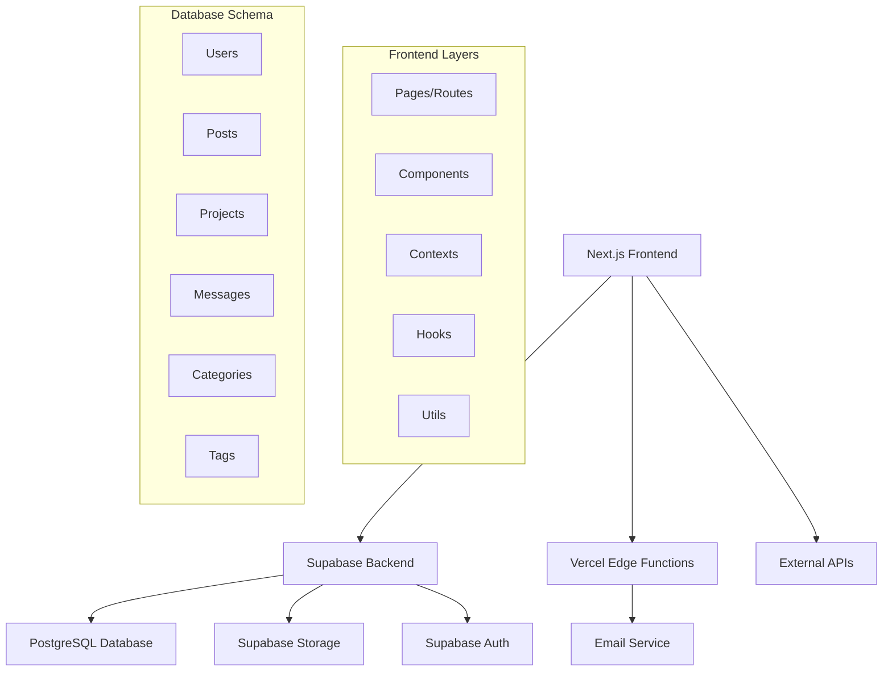
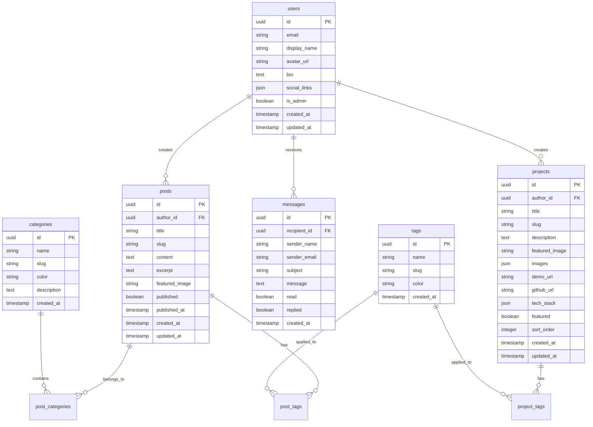

# 디자인 문서

## 개요

litsy.me를 현대적이고 전문적인 포트폴리오/블로그 서비스로 변환하는 종합적인 디자인입니다. Next.js 14, Supabase, TypeScript를 기반으로 하며, 기존 인증 시스템을 활용하여 완전한 콘텐츠 관리 시스템을 구축합니다.

## 아키텍처

### 전체 시스템 아키텍처



### 데이터베이스 스키마



## 컴포넌트 및 인터페이스

### 페이지 구조

```
app/
├── page.tsx                 # 메인 홈페이지
├── about/page.tsx          # 소개 페이지
├── blog/
│   ├── page.tsx            # 블로그 목록
│   ├── [slug]/page.tsx     # 블로그 포스트 상세
│   └── category/[slug]/page.tsx # 카테고리별 포스트
├── projects/
│   ├── page.tsx            # 프로젝트 목록
│   └── [slug]/page.tsx     # 프로젝트 상세
├── contact/page.tsx        # 연락처 페이지
├── admin/
│   ├── page.tsx            # 관리자 대시보드
│   ├── posts/
│   │   ├── page.tsx        # 포스트 관리
│   │   ├── new/page.tsx    # 새 포스트 작성
│   │   └── [id]/edit/page.tsx # 포스트 편집
│   ├── projects/
│   │   ├── page.tsx        # 프로젝트 관리
│   │   ├── new/page.tsx    # 새 프로젝트 추가
│   │   └── [id]/edit/page.tsx # 프로젝트 편집
│   ├── messages/page.tsx   # 메시지 관리
│   └── settings/page.tsx   # 사이트 설정
└── api/
    ├── posts/              # 포스트 API
    ├── projects/           # 프로젝트 API
    ├── messages/           # 메시지 API
    └── upload/             # 파일 업로드 API
```

### 핵심 컴포넌트

#### 1. 레이아웃 컴포넌트
- `Header`: 네비게이션, 다크모드 토글, 사용자 메뉴
- `Footer`: 소셜 링크, 저작권 정보
- `Sidebar`: 관리자 페이지 사이드바
- `MobileMenu`: 모바일 네비게이션

#### 2. 콘텐츠 컴포넌트
- `PostCard`: 블로그 포스트 카드
- `ProjectCard`: 프로젝트 카드
- `PostEditor`: 마크다운 에디터
- `ImageUploader`: 이미지 업로드 컴포넌트
- `TagSelector`: 태그 선택 컴포넌트

#### 3. UI 컴포넌트
- `SearchBar`: 검색 입력
- `FilterTabs`: 카테고리/태그 필터
- `Pagination`: 페이지네이션
- `LoadingSpinner`: 로딩 표시
- `ErrorBoundary`: 에러 처리

### 상태 관리

#### Context 구조
```typescript
// 기존 AuthContext 확장
interface AuthContextType {
  user: User | null;
  loading: boolean;
  signIn: (email: string, password: string) => Promise<void>;
  signUp: (email: string, password: string) => Promise<void>;
  signOut: () => Promise<void>;
  isAdmin: boolean;
  getUserDisplayName: () => string;
  getUserAvatar: () => string;
}

// 새로운 Context들
interface ThemeContextType {
  theme: 'light' | 'dark';
  toggleTheme: () => void;
}

interface AdminContextType {
  posts: Post[];
  projects: Project[];
  messages: Message[];
  loading: boolean;
  refreshData: () => Promise<void>;
}
```

## 데이터 모델

### TypeScript 인터페이스

```typescript
interface Post {
  id: string;
  author_id: string;
  title: string;
  slug: string;
  content: string;
  excerpt: string;
  featured_image?: string;
  published: boolean;
  published_at?: string;
  created_at: string;
  updated_at: string;
  categories: Category[];
  tags: Tag[];
  author: User;
}

interface Project {
  id: string;
  author_id: string;
  title: string;
  slug: string;
  description: string;
  featured_image?: string;
  images: string[];
  demo_url?: string;
  github_url?: string;
  tech_stack: string[];
  featured: boolean;
  sort_order: number;
  created_at: string;
  updated_at: string;
  tags: Tag[];
}

interface Message {
  id: string;
  recipient_id: string;
  sender_name: string;
  sender_email: string;
  subject: string;
  message: string;
  read: boolean;
  replied: boolean;
  created_at: string;
}

interface Category {
  id: string;
  name: string;
  slug: string;
  color: string;
  description?: string;
  created_at: string;
}

interface Tag {
  id: string;
  name: string;
  slug: string;
  color: string;
  created_at: string;
}
```

## 에러 처리

### 에러 처리 전략

1. **클라이언트 사이드 에러**
   - React Error Boundary로 컴포넌트 레벨 에러 처리
   - Toast 알림으로 사용자 친화적 에러 메시지
   - 폼 유효성 검사 에러 표시

2. **서버 사이드 에러**
   - API 라우트에서 적절한 HTTP 상태 코드 반환
   - Supabase 에러를 사용자 친화적 메시지로 변환
   - 로깅 시스템으로 에러 추적

3. **네트워크 에러**
   - 재시도 로직 구현
   - 오프라인 상태 감지 및 알림
   - 로딩 상태 관리

### 에러 처리 컴포넌트

```typescript
interface ErrorBoundaryState {
  hasError: boolean;
  error?: Error;
}

class ErrorBoundary extends Component<PropsWithChildren, ErrorBoundaryState> {
  // 에러 캐치 및 폴백 UI 렌더링
}

const ErrorFallback = ({ error, resetError }: ErrorFallbackProps) => {
  // 사용자 친화적 에러 화면
}
```

## 테스팅 전략

### 테스트 계층

1. **단위 테스트**
   - 유틸리티 함수 테스트
   - 커스텀 훅 테스트
   - 컴포넌트 로직 테스트

2. **통합 테스트**
   - API 라우트 테스트
   - 데이터베이스 연동 테스트
   - 인증 플로우 테스트

3. **E2E 테스트**
   - 사용자 시나리오 테스트
   - 크로스 브라우저 테스트
   - 모바일 반응형 테스트

### 테스트 도구

- **Jest**: 단위 테스트 프레임워크
- **React Testing Library**: 컴포넌트 테스트
- **Playwright**: E2E 테스트
- **MSW**: API 모킹

## 성능 최적화

### 최적화 전략

1. **이미지 최적화**
   - Next.js Image 컴포넌트 사용
   - WebP 포맷 지원
   - 지연 로딩 구현

2. **코드 분할**
   - 동적 import로 컴포넌트 분할
   - 라우트 기반 코드 분할
   - 라이브러리 번들 최적화

3. **캐싱 전략**
   - ISR(Incremental Static Regeneration) 활용
   - API 응답 캐싱
   - 브라우저 캐싱 최적화

4. **데이터베이스 최적화**
   - 인덱스 최적화
   - 쿼리 최적화
   - 페이지네이션 구현

### 성능 모니터링

- Core Web Vitals 추적
- 번들 크기 모니터링
- 데이터베이스 쿼리 성능 추적
- 사용자 경험 메트릭 수집

## SEO 및 접근성

### SEO 최적화

1. **메타데이터 관리**
   - 동적 메타 태그 생성
   - Open Graph 태그
   - Twitter Card 지원

2. **구조화된 데이터**
   - JSON-LD 스키마 마크업
   - 블로그 포스트 스키마
   - 개인 프로필 스키마

3. **사이트맵 및 로봇**
   - 동적 사이트맵 생성
   - robots.txt 최적화
   - 검색 엔진 크롤링 최적화

### 접근성 구현

1. **키보드 네비게이션**
   - 탭 순서 최적화
   - 포커스 표시 개선
   - 키보드 단축키 지원

2. **스크린 리더 지원**
   - ARIA 라벨 적용
   - 시맨틱 HTML 사용
   - 대체 텍스트 제공

3. **색상 및 대비**
   - WCAG 2.1 AA 기준 준수
   - 다크모드 지원
   - 고대비 모드 지원

## 보안 고려사항

### 보안 조치

1. **인증 및 권한**
   - JWT 토큰 보안
   - 역할 기반 접근 제어
   - 세션 관리 강화

2. **데이터 보호**
   - SQL 인젝션 방지
   - XSS 공격 방지
   - CSRF 토큰 사용

3. **파일 업로드 보안**
   - 파일 타입 검증
   - 파일 크기 제한
   - 악성 코드 스캔

4. **API 보안**
   - Rate limiting 구현
   - API 키 관리
   - CORS 설정 최적화